# Adventure Works Azure Data Platform

An end-to-end Azure data engineering proof of concept that ingests Adventure Works CSV data with Azure Data Factory, transforms it with Azure Databricks and PySpark, stores bronze and silver layers in Azure Data Lake Storage Gen2, and exposes analytical views through Synapse serverless SQL.

> **Current maturity:** working proof-of-concept implementation with manually provisioned Azure resources. This repository captures the source data, ingestion metadata, Spark transformations, and serving-layer SQL.

## Project outcomes

- Models a medallion-style batch data pipeline across bronze, silver, and gold layers.
- Uses metadata to describe ingestion of ten source datasets rather than treating every file as a separate design.
- Applies PySpark transformations in Azure Databricks.
- Stores curated output in an ADLS Gen2 silver layer.
- Exposes data to SQL consumers through Synapse serverless views.
- Documents the manually configured Azure environment.


## Architecture

```mermaid
flowchart LR
    source["GitHub CSV files"]
    adf["Azure Data Factory<br/>Metadata-driven ingestion"]
    bronze[("ADLS Gen2<br/>Bronze CSV")]
    dbx["Azure Databricks<br/>PySpark transformations"]
    silver[("ADLS Gen2<br/>Silver Parquet")]
    synapse["Synapse serverless SQL<br/>Gold views"]
    consumer["SQL consumers<br/>BI and analytics"]

    source -->|"HTTP copy"| adf
    adf -->|"Batch ingestion"| bronze
    bronze -->|"ABFSS read"| dbx
    dbx -->|"Curated output"| silver
    silver -->|"OPENROWSET"| synapse
    synapse --> consumer
```



The implementation separates ingestion, transformation, storage, and serving responsibilities. Azure resources were created in the portal for the initial proof of concept; their settings are not yet fully represented as code.

## Technology stack

| Area | Technology | Responsibility |
|---|---|---|
| Source | GitHub-hosted CSV files | Adventure Works batch source data |
| Orchestration | Azure Data Factory | Metadata-driven ingestion into the data lake |
| Storage | Azure Data Lake Storage Gen2 | Bronze source and silver curated layers |
| Processing | Azure Databricks, PySpark | Schema inference, transformations, and Parquet output |
| Serving | Synapse serverless SQL | Gold views queried directly over the silver layer |
| [Planned] Target infrastructure | Terraform | Planned reproducible Azure provisioning |
| [Planned] Target delivery | GitHub Actions and Databricks Bundles | Planned validation and workload deployment |

## Data flow

### 1. Source and ingestion

The [`Adventure_Works_Dataset`](./Adventure_Works_Dataset) directory contains ten Adventure Works datasets. [`git.json`](./Scripts/git.json) describes the source paths and target folder/file names used by the ingestion process.

In the deployed proof of concept, Azure Data Factory copies these files into the ADLS Gen2 bronze layer. The ADF factory, linked services, datasets, pipeline, and triggers were created manually and are not currently exported into this repository.

### 2. Bronze-to-silver transformation

[`silver_layer.ipynb`](./Scripts/silver_layer.ipynb) reads bronze CSV data through ABFSS paths and performs transformations including:

- calendar month and year derivation
- customer full-name creation
- product field processing
- sales date conversion and derived values
- consolidation of annual sales files
- Parquet writes into named silver-layer folders

The notebook is retained as the reference artifact from the proof of concept.

### 3. Gold serving layer

[`gold_layer.sql`](./Scripts/gold_layer.sql) defines Synapse serverless SQL views over the silver Parquet folders using `OPENROWSET`.

These views provide a SQL-facing gold layer for calendars, customers, products, returns, sales, subcategories, and territories.

## Source datasets

| Dataset | Purpose |
|---|---|
| Calendar | Date dimension source |
| Customers | Customer attributes |
| Product Categories | Top-level product hierarchy |
| Product Subcategories | Product hierarchy detail |
| Products | Product attributes and pricing |
| Returns | Product return events |
| Sales 2015 | Annual sales facts |
| Sales 2016 | Annual sales facts |
| Sales 2017 | Annual sales facts |
| Territories | Sales geography |


## Repository structure

```text
.
├── Data/
│   ├── AdventureWorks_*.csv
|   └── DATASET_README.md
├── Scripts/
│   ├── git.json
│   ├── silver_layer.ipynb
│   └── gold_layer.sql
└── README.md
```

## Current deployment model

The Azure environment was assembled through portal-based configuration to validate the end-to-end design quickly.

The manual deployment included these broad activities:

1. Creating a resource group and selecting an Azure region.
2. Creating an ADLS Gen2 account with bronze and silver storage areas.
3. Creating Azure Data Factory linked services, datasets, and an ingestion pipeline.
4. Granting or configuring ADF access to the bronze layer.
5. Creating an Azure Databricks workspace and compute.
6. Configuring Databricks access to bronze and silver storage.
7. Importing and running the PySpark notebook.
8. Creating a Synapse workspace and using its serverless SQL endpoint.
9. Configuring Synapse access to silver storage.
10. Creating the gold schema and SQL views.

