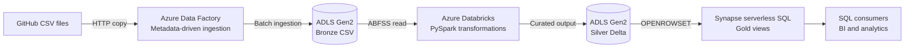

# Adventure Works Azure Data Platform

An end-to-end Azure data engineering proof of concept that ingests Adventure Works CSV data with
Azure Data Factory, transforms it with Azure Databricks and PySpark, stores bronze and silver layers
in Azure Data Lake Storage Gen2, and exposes analytical views through Synapse serverless SQL.

> **Current maturity:** the original proof of concept is working, and its replacement now has locally
> validated Terraform, metadata-driven ingestion, tested transformations, a cost-bounded Databricks
> bundle, typed Synapse serverless views, and GitHub Actions delivery controls. Live Azure deployment
> evidence remains pending.

## Project outcomes

- Models a medallion-style batch pipeline across bronze, silver, and gold layers.
- Uses metadata to describe ingestion of ten source datasets.
- Applies PySpark transformations in Azure Databricks.
- Stores curated output in an ADLS Gen2 silver layer.
- Exposes SQL views through Synapse serverless.
- Provides Terraform infrastructure, remote state, deployment safeguards, and contract tests.
- Uses credential-free pull-request checks and approved OIDC deployment for development.
- Defines the `develop` branch ruleset as import-safe Terraform with isolated state.

## Architecture


```mermaid
flowchart LR
    source["GitHub CSV files"]
    adf["Azure Data Factory<br/>Metadata-driven ingestion"]
    bronze[("ADLS Gen2<br/>Bronze CSV")]
    dbx["Azure Databricks<br/>PySpark transformations"]
    silver[("ADLS Gen2<br/>Silver Delta")]
    synapse["Synapse serverless SQL<br/>Gold views"]
    consumer["SQL consumers<br/>BI and analytics"]

    source -->|"HTTP copy"| adf
    adf -->|"Batch ingestion"| bronze
    bronze -->|"ABFSS read"| dbx
    dbx -->|"Curated output"| silver
    silver -->|"OPENROWSET"| synapse
    synapse --> consumer
```

The original resources were created in the portal. The repository now defines a clean replacement
environment in Terraform; it does not attempt to import or modify the original resources.

## Technology stack

| Area | Technology | Responsibility |
|---|---|---|
| Source | GitHub-hosted CSV files | Adventure Works batch source data |
| Orchestration | Azure Data Factory | Metadata-driven ingestion into the lake |
| Storage | Azure Data Lake Storage Gen2 | Bronze source and silver curated layers |
| Processing | Azure Databricks, PySpark | Tested transformations and Delta output |
| Serving | Synapse serverless SQL | Gold views over the silver layer |
| Infrastructure | Terraform | Reproducible Azure provisioning and remote state |
| Target delivery | GitHub Actions and Databricks Bundles | Validation and workload deployment |
| Repository governance | GitHub Rulesets and Terraform | Pull-request, CI, and branch safety controls |

## Data flow

### Source and ingestion

[`Adventure_Works_Dataset`](./Adventure_Works_Dataset) contains ten source datasets.
[`config/datasets.json`](./config/datasets.json) is the canonical ingestion manifest. It defines
logical dataset names, commit-relative source paths, bronze destinations, and expected row counts.
The legacy [`Scripts/git.json`](./Scripts/git.json) remains only as a record of the original manually
configured pipeline and is not used by the code-based ingestion path.

Terraform defines the ADF linked services, parameterized datasets, and Lookup → ForEach → Copy →
Get Metadata pipeline. See the [ADF ingestion guide](./docs/adf-ingestion.md).

### Bronze-to-silver transformation

The production transformation package under [`src/adventure_works`](./src/adventure_works) reads
bronze CSV data with explicit schemas, applies pure tested transformations and fail-fast quality
rules, and writes eight lowercase Delta targets using dimension overwrite and fact MERGE semantics.
The package is built as a wheel and deployed to a bounded job cluster through a Databricks bundle.
See the [PySpark transformation guide](./docs/spark-transformations.md) and
[Databricks bundle guide](./docs/databricks-bundle.md).

[`silver_layer.ipynb`](./Scripts/silver_layer.ipynb) remains as a legacy proof-of-concept artifact
until the replacement Databricks job completes its Azure verification gate.

### Gold serving layer

The production SQL under [`synapse/sql`](./synapse/sql) creates a UTF-8 serving database, uses the
workspace managed identity to read Delta, and publishes six dimensions, two facts, and two joined
analytical views with explicit types. See the
[Synapse serving guide](./docs/synapse-serving.md). The original
[`gold_layer.sql`](./Scripts/gold_layer.sql) remains as migration evidence only.

## Source datasets

| Dataset | Rows | Purpose |
|---|---:|---|
| Calendar | 912 | Date dimension source |
| Customers | 18,148 | Customer attributes |
| Product Categories | 4 | Top-level product hierarchy |
| Product Subcategories | 37 | Product hierarchy detail |
| Products | 293 | Product attributes and pricing |
| Returns | 1,809 | Product return events |
| Sales 2015 | 2,630 | Annual sales facts |
| Sales 2016 | 23,935 | Annual sales facts |
| Sales 2017 | 29,481 | Annual sales facts |
| Territories | 10 | Sales geography |

## Repository structure

```text
.
|-- Adventure_Works_Dataset/
|   |-- AdventureWorks_*.csv
|   `-- DATASET_README.md
|-- .github/
|   |-- workflows/
|   `-- dependabot.yml
|-- config/
|   `-- datasets.json
|-- databricks/
|   |-- databricks.yml
|   `-- resources/job.yml
|-- docs/
|   |-- architecture-decisions.md
|   |-- cicd.md
|   |-- databricks-bundle.md
|   |-- deployment.md
|   |-- environment-conventions.md
|   |-- legacy-artifacts.md
|   |-- operations-runbook.md
|   |-- spark-transformations.md
|   `-- synapse-serving.md
|-- infra/
|   |-- bootstrap/
|   |-- environments/
|   |-- github/
|   `-- platform/
|-- Scripts/
|   |-- git.json
|   |-- silver_layer.ipynb
|   `-- gold_layer.sql
|-- synapse/
|   `-- sql/
|-- src/adventure_works/
|-- tests/
|-- tools/
|   |-- Initialize-TerraformState.ps1
|   |-- Invoke-AdfIngestion.ps1
|   |-- Invoke-DatabricksBundle.ps1
|   |-- Invoke-DevDeployment.ps1
|   |-- Invoke-SynapseServing.ps1
|   |-- Remove-DatabricksWorkspace.ps1
|   `-- validate_repository.py
|-- pyproject.toml
|-- CONTRIBUTING.md
`-- README.md
```

## Local validation

The dependency-free repository contract checks ingestion metadata, filenames, uniqueness, source
file presence, CSV row counts, and compatibility metadata synchronization:

```powershell
python tools/validate_repository.py
```

Expected summary:

```text
Repository validation PASSED
  Metadata entries: 10
  CSV datasets: 10
  Total data rows: 77,259
  Canonical ingestion metadata matches the source-data contract
  Delta merge keys and source relationships are valid
```

Optional development checks:

```powershell
python -m venv .venv
.\.venv\Scripts\Activate.ps1
python -m pip install -e ".[dev,spark]"
python -m pytest
python -m ruff check src tests tools
```

Pull requests run the same code, data, SQL, packaging, PowerShell, and Terraform checks through
GitHub Actions. See the [CI/CD guide](./docs/cicd.md).

## Deployment model

The original Azure environment was assembled through portal-based configuration to validate the
design. The replacement platform is defined in `infra/platform`, with a separate `infra/bootstrap`
root for Azure Blob remote state. PowerShell workflows enforce plan review before apply, verify
idempotence, capture a private resource inventory, and produce a destroy plan for cost control.

Only development is intended for deployment. Test and production reuse the same Terraform root and
remain configuration-ready. See the [development deployment guide](./docs/deployment.md) for the
review, apply, verification, evidence, and cleanup workflow.

Terraform covers the Azure resource group, ADLS Gen2, Data Factory, Databricks workspace, Synapse
workspace, Log Analytics, diagnostics, and managed-identity storage permissions. ADF pipelines, the
Databricks job, and the Synapse serving objects are source controlled.

## Known limitations

- Live Azure deployment and idempotence evidence have not yet been captured.
- The code-defined ADF ingestion pipeline has not yet completed its live Azure verification run.
- The replacement PySpark modules and Delta behavior have not yet completed their live Databricks
  verification runs.
- The Databricks bundle has not yet completed its live deployment and two-run verification.
- The replacement Synapse SQL has not yet completed live deployment and query verification.
- CI/CD definitions are locally validated but have not yet completed their first GitHub-hosted runs.
- The existing `develop` ruleset is represented in Terraform but has not yet been imported into
  remote state or updated from the reviewed plan.
- Azure-native ADF failure alerting is code complete but has not completed a live notification test.
- A consolidated Azure dashboard is not included in the scoped portfolio build.
- Unity Catalog is outside this project's scope.

## Productionization strategy

The planned productionization sequence is:

1. Repository engineering foundation
2. Locally validated Terraform foundation
3. Reviewed Terraform plan and dev Azure deployment
4. Source-controlled ADF ingestion
5. Tested, idempotent PySpark and Delta transformations
6. Databricks Bundle job deployment
7. Idempotent Synapse serving layer
8. CI/CD, operational documentation, and portfolio evidence
9. Repository governance as code

Only `dev` needs to be deployed. `test` and `prod` will remain configuration-ready to demonstrate a
promotion model without unnecessary Azure cost.

## Productionization progress

- Step 1: Repository engineering foundation - complete
- Step 2: Locally validated Terraform platform foundation - complete
- Step 3: Remote-state and controlled dev deployment workflow - code complete; Azure verification pending
- Step 4: Metadata-driven ADF ingestion - code complete; Azure run verification pending
- Step 5: Tested, idempotent PySpark and Delta transformations - code complete; Databricks verification pending
- Step 6: Databricks Bundle job deployment - code complete; live workspace verification pending
- Step 7: Idempotent Synapse serving layer - code complete; live query verification pending
- Step 8: CI/CD, operational runbook, and evidence templates - code complete; GitHub/Azure setup pending
- Step 9: Import-safe `develop` ruleset and governance contracts - code complete; apply verification pending
- [Architecture decisions](./docs/architecture-decisions.md)
- [ADF ingestion guide](./docs/adf-ingestion.md)
- [PySpark transformation guide](./docs/spark-transformations.md)
- [Databricks bundle deployment guide](./docs/databricks-bundle.md)
- [Synapse serverless serving guide](./docs/synapse-serving.md)
- [CI/CD and GitHub environment guide](./docs/cicd.md)
- [GitHub repository governance guide](./docs/github-governance.md)
- [Operations runbook](./docs/operations-runbook.md)
- [Portfolio evidence guide](./docs/evidence/README.md)
- [Development deployment guide](./docs/deployment.md)
- [Environment and naming conventions](./docs/environment-conventions.md)
- [Legacy artifact migration plan](./docs/legacy-artifacts.md)

## Security and cost direction

- Prefer managed identities and Azure RBAC over keys and embedded client secrets.
- Use workload identity federation for CI/CD authentication; do not store Azure client secrets.
- Never commit Terraform state, `.tfvars` containing environment values, tokens, or credentials.
- Use small auto-terminating Databricks job compute for this dataset.
- Keep Databricks disabled during routine deployment because its managed resource group can include
  an hourly billed NAT Gateway. Enable it only for the demonstration and run the verified workspace,
  managed resource-group, and NAT Gateway cleanup afterward.
- Deploy only the development environment for the portfolio demonstration.
- Review a Terraform destroy plan and remove unused demo resources after evidence is captured.

## Repository health

The repository includes metadata and source-data validation, Terraform deployment contracts,
remote-state infrastructure, controlled development deployment commands, and code-defined ADF
ingestion with run-level verification. Explicit-schema PySpark modules add tested quality rules and
idempotent Delta write semantics. GitHub Actions applies the same quality gates and restricts Azure
deployment to an approved OIDC workflow. Run the commands under
[Local validation](#local-validation) before opening a pull request.
