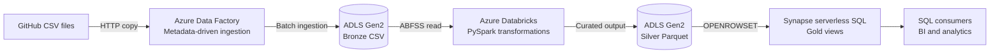

# Adventure Works Azure Data Platform

An end-to-end Azure data engineering proof of concept that ingests Adventure Works CSV data with
Azure Data Factory, transforms it with Azure Databricks and PySpark, stores bronze and silver layers
in Azure Data Lake Storage Gen2, and exposes analytical views through Synapse serverless SQL.

> **Current maturity:** the original proof of concept is working, and its Azure platform now has a
> locally validated Terraform definition with remote-state bootstrap and controlled dev deployment
> commands. Live deployment evidence is pending; workload artifacts are being migrated incrementally.

## Project outcomes

- Models a medallion-style batch pipeline across bronze, silver, and gold layers.
- Uses metadata to describe ingestion of ten source datasets.
- Applies PySpark transformations in Azure Databricks.
- Stores curated output in an ADLS Gen2 silver layer.
- Exposes SQL views through Synapse serverless.
- Provides Terraform infrastructure, remote state, deployment safeguards, and contract tests.

## Architecture


```mermaid
flowchart LR
    source["GitHub CSV files"]
    adf["Azure Data Factory<br/>Metadata-driven ingestion"]
    bronze[("ADLS Gen2<br/>Bronze CSV")]
    dbx["Azure Databricks<br/>PySpark transformations"]
    silver[("ADLS Gen2<br/>Silver Parquet")]
    synapse["Synapse serverless SQL<br/>Gold views"]
    consumer["SQL consumers<br/>BI and analytics"]

    source -->|"HTTP copy"| adf
    adf -->|"Batch ingestion"| bronze
    bronze -->|"ABFSS read"| dbx
    dbx -->|"Curated output"| silver
    silver -->|"OPENROWSET"| synapse
    synapse --> consumer
```

The original resources were created in the portal. The repository now defines a clean replacement
environment in Terraform; it does not attempt to import or modify the original resources.

## Technology stack

| Area | Technology | Responsibility |
|---|---|---|
| Source | GitHub-hosted CSV files | Adventure Works batch source data |
| Orchestration | Azure Data Factory | Metadata-driven ingestion into the lake |
| Storage | Azure Data Lake Storage Gen2 | Bronze source and silver curated layers |
| Processing | Azure Databricks, PySpark | Transformations and Parquet output |
| Serving | Synapse serverless SQL | Gold views over the silver layer |
| Infrastructure | Terraform | Reproducible Azure provisioning and remote state |
| Target delivery | GitHub Actions and Databricks Bundles | Validation and workload deployment |

## Data flow

### Source and ingestion

[`Adventure_Works_Dataset`](./Adventure_Works_Dataset) contains ten source datasets.
[`config/datasets.json`](./config/datasets.json) is the target canonical ingestion configuration.
The existing [`Scripts/git.json`](./Scripts/git.json) remains temporarily for compatibility with the
manually configured ADF pipeline. Repository validation requires both files to stay synchronized.

ADF factory artifacts are not yet checked in. Their source-controlled replacement is a later gated
productionization step.

### Bronze-to-silver transformation

[`silver_layer.ipynb`](./Scripts/silver_layer.ipynb) reads bronze CSV data through ABFSS paths and
performs calendar, customer, product, sales, returns, subcategory, and territory processing. It
writes Parquet files to silver storage.

The notebook is a legacy proof-of-concept artifact. It will remain available until tested Python
modules and a Databricks Bundle have been deployed successfully.

### Gold serving layer

[`gold_layer.sql`](./Scripts/gold_layer.sql) defines Synapse serverless views over the silver Parquet
folders using `OPENROWSET`. It will later be replaced by ordered, parameterized, idempotent SQL.

## Source datasets

| Dataset | Rows | Purpose |
|---|---:|---|
| Calendar | 912 | Date dimension source |
| Customers | 18,148 | Customer attributes |
| Product Categories | 4 | Top-level product hierarchy |
| Product Subcategories | 37 | Product hierarchy detail |
| Products | 293 | Product attributes and pricing |
| Returns | 1,809 | Product return events |
| Sales 2015 | 2,630 | Annual sales facts |
| Sales 2016 | 23,935 | Annual sales facts |
| Sales 2017 | 29,481 | Annual sales facts |
| Territories | 10 | Sales geography |

## Repository structure

```text
.
|-- Adventure_Works_Dataset/
|   |-- AdventureWorks_*.csv
|   `-- DATASET_README.md
|-- config/
|   `-- datasets.json
|-- docs/
|   |-- architecture-decisions.md
|   |-- deployment.md
|   |-- environment-conventions.md
|   `-- legacy-artifacts.md
|-- infra/
|   |-- bootstrap/
|   |-- environments/
|   `-- platform/
|-- Scripts/
|   |-- git.json
|   |-- silver_layer.ipynb
|   `-- gold_layer.sql
|-- src/adventure_works/
|-- tests/
|-- tools/
|   |-- Initialize-TerraformState.ps1
|   |-- Invoke-DevDeployment.ps1
|   `-- validate_repository.py
|-- pyproject.toml
`-- README.md
```

## Local validation

The dependency-free repository contract checks ingestion metadata, filenames, uniqueness, source
file presence, CSV row counts, and compatibility metadata synchronization:

```powershell
python tools/validate_repository.py
```

Expected summary:

```text
Repository validation PASSED
  Metadata entries: 10
  CSV datasets: 10
  Total data rows: 77,259
  Canonical and legacy ingestion metadata are synchronized
```

Optional development checks:

```powershell
python -m venv .venv
.\.venv\Scripts\Activate.ps1
python -m pip install -e ".[dev]"
python -m pytest
python -m ruff check src tests tools
```

## Deployment model

The original Azure environment was assembled through portal-based configuration to validate the
design. The replacement platform is defined in `infra/platform`, with a separate `infra/bootstrap`
root for Azure Blob remote state. PowerShell workflows enforce plan review before apply, verify
idempotence, capture a private resource inventory, and produce a destroy plan for cost control.

Only development is intended for deployment. Test and production reuse the same Terraform root and
remain configuration-ready. See the [development deployment guide](./docs/deployment.md) for the
review, apply, verification, evidence, and cleanup workflow.

Terraform covers the Azure resource group, ADLS Gen2, Data Factory, Databricks workspace, Synapse
workspace, Log Analytics, diagnostics, and managed-identity storage permissions. ADF pipelines,
Databricks jobs, and Synapse SQL objects are handled in later productionization steps.

## Known limitations

- Live Azure deployment and idempotence evidence have not yet been captured.
- ADF linked services, datasets, and pipeline artifacts are not yet defined as code.
- The notebook uses direct client-secret placeholders and hard-coded storage paths.
- CSV schemas are inferred rather than explicitly declared.
- Append-mode Parquet writes are not idempotent.
- Product categories are read but not written to silver.
- Some destructive product and sales transformations lack a documented business requirement.
- Databricks compute, jobs, dependencies, and permissions are not deployable.
- Synapse SQL is not parameterized or idempotent and uses `SELECT *`.
- Automated data-quality tests, CI/CD, monitoring, and rollback are not yet implemented.
- Unity Catalog is outside this project's scope.

## Productionization strategy

The planned productionization sequence is:

1. Repository engineering foundation
2. Locally validated Terraform foundation
3. Reviewed Terraform plan and dev Azure deployment
4. Source-controlled ADF ingestion
5. Tested, idempotent PySpark and Delta transformations
6. Databricks Bundle job deployment
7. Idempotent Synapse serving layer
8. CI/CD, operational documentation, and portfolio evidence

Only `dev` needs to be deployed. `test` and `prod` will remain configuration-ready to demonstrate a
promotion model without unnecessary Azure cost.

## Productionization progress

- Step 1: Repository engineering foundation - complete
- Step 2: Locally validated Terraform platform foundation - complete
- Step 3: Remote-state and controlled dev deployment workflow - code complete; Azure verification pending
- [Architecture decisions](./docs/architecture-decisions.md)
- [Development deployment guide](./docs/deployment.md)
- [Environment and naming conventions](./docs/environment-conventions.md)
- [Legacy artifact migration plan](./docs/legacy-artifacts.md)

## Security and cost direction

- Prefer managed identities and Azure RBAC over keys and embedded client secrets.
- Use workload identity federation for future CI/CD authentication.
- Never commit Terraform state, `.tfvars` containing environment values, tokens, or credentials.
- Use small auto-terminating Databricks job compute for this dataset.
- Deploy only the development environment for the portfolio demonstration.
- Review a Terraform destroy plan and remove unused demo resources after evidence is captured.

## Repository health

The repository includes metadata and source-data validation, Terraform deployment contract tests,
remote-state infrastructure, and controlled development deployment commands. Run the commands under
[Local validation](#local-validation) before opening a pull request.
